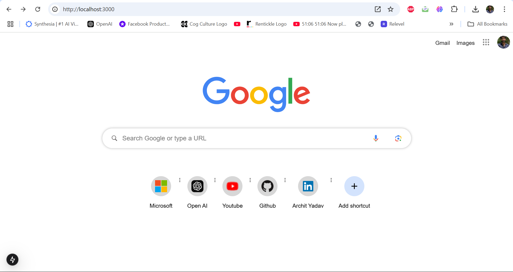
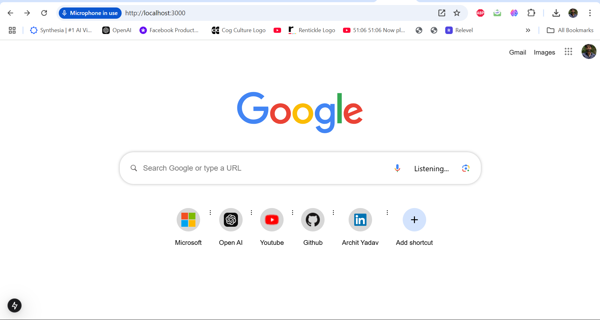
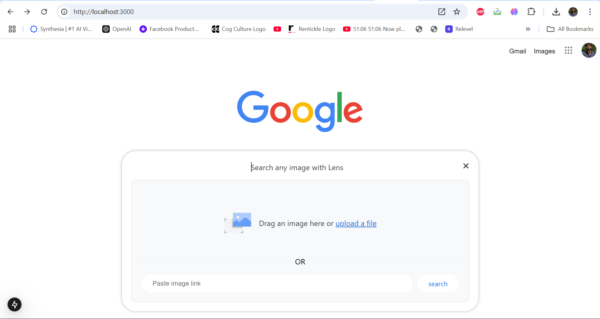
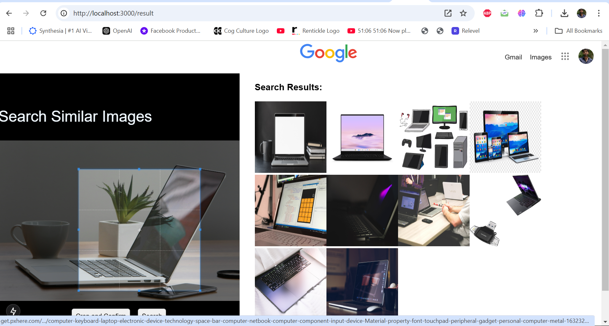
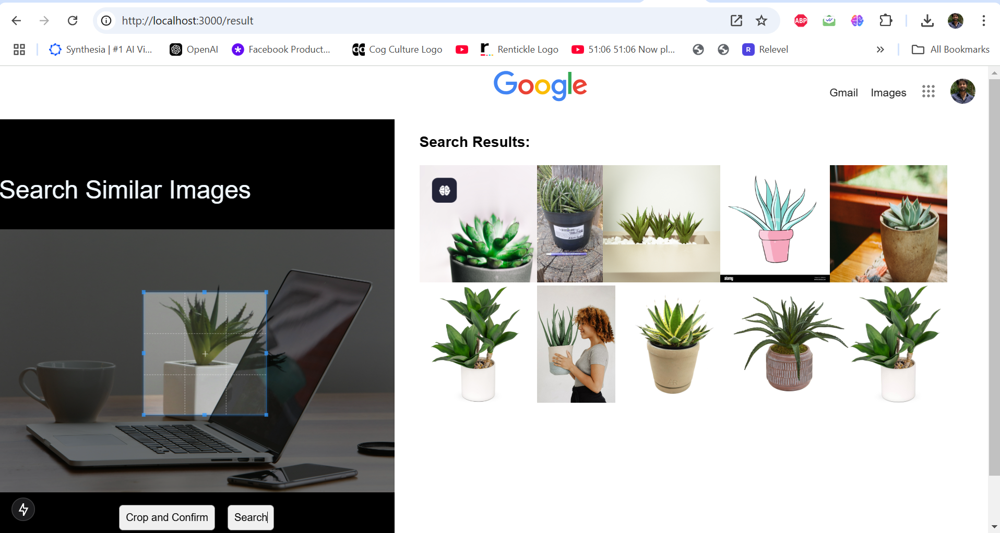
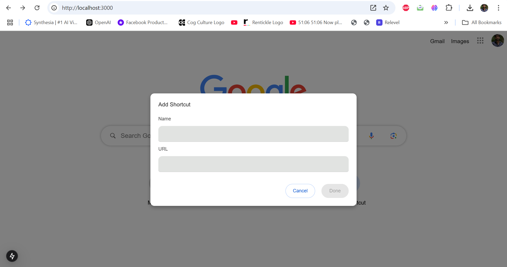

# Google UI - NEXTJS Project

## Table of Contents
1. [Introduction](#introduction)
2. [Features](#features)
3. [Installation](#installation)
4. [Usage](#usage)
5. [Contributing](#contributing)
6. [License](#license)

## Introduction
Google UI is a feature-rich NEXTJS project designed to emulate the user interface and experience of Google. This project showcases a sleek and modern design with advanced functionalities, including image search, voice search, image recognition using Google Vision API, and more. Built with cutting-edge libraries and frameworks, Google UI offers a robust and user-friendly solution for web search functionalities.

## Image Preview
To give you a visual representation of the project, here are three preview images showcasing different features of the Google UI:

## Image 1: Home Search Page
This image displays the main search interface where users can enter text or use voice search. It highlights the clean design and the easy access to search functionalities.





## Image 2: Image Upload 
This preview shows the image upload section integrated with react-dropzone. It allows users to drag and drop images, and perform image recognition using Google Vision API.



## Crop Section of the Image:

The image can be cropped by selecting the desired area.
Aspect Ratio: The crop feature supports maintaining a fixed aspect ratio (1:1 for square images).
Crop Confirmation: After selecting the crop area, users can confirm the crop, and the selected section will be processed.

Analyze Whole Image:

Automatically analyzes the entire uploaded image for relevant features (labels, objects, etc.).
Uses Google Vision API to extract information from the image.
Analyze Cropped Section:



After cropping, users can analyze only the selected section of the image.
This enables users to get more focused insights about specific parts of the image.
Results Display:



Once analysis is complete, the results (labels, objects) are displayed in a grid format.
Responsive Grid: Results are shown in a 3x3 grid layout, allowing easy navigation through multiple results.


## Image 3: Bookmark Manager
This image illustrates the bookmark manager functionality. Users can add, edit, and delete shortcuts to their most visited URLs. It showcases the storage in IndexedDB, allowing for persistent data without loss.





## Features
- **Text Search**: Implements a text search similar to Google, allowing users to quickly search the web for any query.
- **Voice Search**: Utilizes `react-speech-recognition` library (version ^3.10.0) to provide a seamless voice search experience. Users can dictate their search queries and get results with minimal delay.
- **Image Search**:
  - **Google Vision API Integration**: Enables image recognition directly from the user's uploads. Uses the Google Vision API to analyze images and provide search results.
  - **Dropzone for Image Uploads**: Integrated with `react-dropzone` (version ^14.3.5) to allow users to easily upload images by dragging and dropping them into a designated area.
  - **Image Cropping**: Users can crop images before uploading using `react-easy-crop` (version ^5.2.0) to focus on specific sections of the image.
- **Bookmark Manager**: Allows users to bookmark up to 9 URLs, edit, and remove them. Each bookmark entry includes an icon of the website and the name of the shortcut.
- **Sleek and Responsive UI**: Styled with SCSS for a Google-like design pattern. Ensures responsiveness across devices and screen sizes.
- **Advanced Error Handling**: Provides user-friendly alerts for invalid URLs and ensures that the search functions are always accurate.
- **Accessibility Features**: Implements best practices for accessibility, including ARIA roles and attributes for navigation and search functionalities.

## Installation
To get started with Google UI, follow these steps:

1. **Clone the repository**:
   ```bash
   git clone https://github.com/archit7820/google_UI.git
   cd google_UI
   ```

2. **Install dependencies**:
   ```bash
   npm install
   ```

3. **Set up your environment variables**:
   - **Google Vision API Key**: You need to set up a Google Cloud project and obtain an API key. Place it in your `.env` file as `NEXT_PUBLIC_GOOGLE_VISION_API_KEY=<YOUR_API_KEY>`.
   - **Search Engine API Key**: Set this API key in your `.env` file as `NEXT_PUBLIC_SEARCH_ENGINE_API_KEY=<YOUR_API_KEY>`.

4. **Run the application**:
   ```bash
   npm run dev
   ```

5. **View the application** in your browser at `http://localhost:3000`.

## Usage
1. **Text Search**: 
   - Enter a query into the search bar and hit `Enter` or click the `search` button to fetch results from the Search Engine API.
   - Use voice search by clicking the microphone icon and speaking your query. The `react-speech-recognition` library will handle the voice input.

2. **Image Search**:
   - Click the `dropzone` area to open the file picker or drag and drop images directly.
   - Once the image is uploaded, use the cropper to select a specific section and click `search`. The image will be sent to the Google Vision API for analysis and search results will be displayed.
   - Cropped images are supported for more precise searches, similar to how Google Lens works.

3. **Bookmark Manager**:
   - Click the `bookmark` icon to add a new shortcut.
   - Enter the name and URL for the shortcut.
   - Use the `edit` icon to modify an existing bookmark.
   - Use the `delete` icon to remove a shortcut.
   - A maximum of 8 bookmarks can be saved.

Persistent Storage with IndexedDB
All bookmarks are stored in IndexedDB, ensuring that the data is not lost even if the application is refreshed. The IndexedDB database is limited to storing a maximum of 9 bookmarks. If the limit is reached, users will receive a notification informing them that they cannot save any more shortcuts.


4. **Design Consistency**:
   - The project adheres closely to Google’s design patterns, with a clean, minimalist design, responsive layout, and smooth animations.
   - SCSS is used for styling to create a consistent and polished look similar to Google’s UI.

## Contributing
Contributions are welcome! If you find any bugs or have ideas for new features, feel free to submit a pull request. Please ensure that:
- You include tests for new features or fixes.
- Follow the existing coding style and conventions.
- Update the README with any new instructions or documentation.

### Reporting Issues
If you encounter any issues, please report them on the [GitHub Issues page](https://github.com/archit7820/google_UI/issues).

## License
This project is licensed under the MIT License. See the [LICENSE](LICENSE) file for more information.
